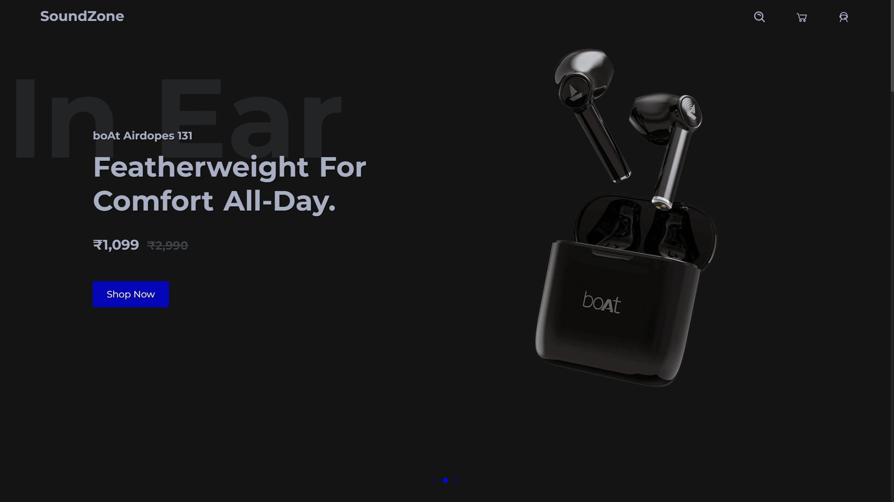
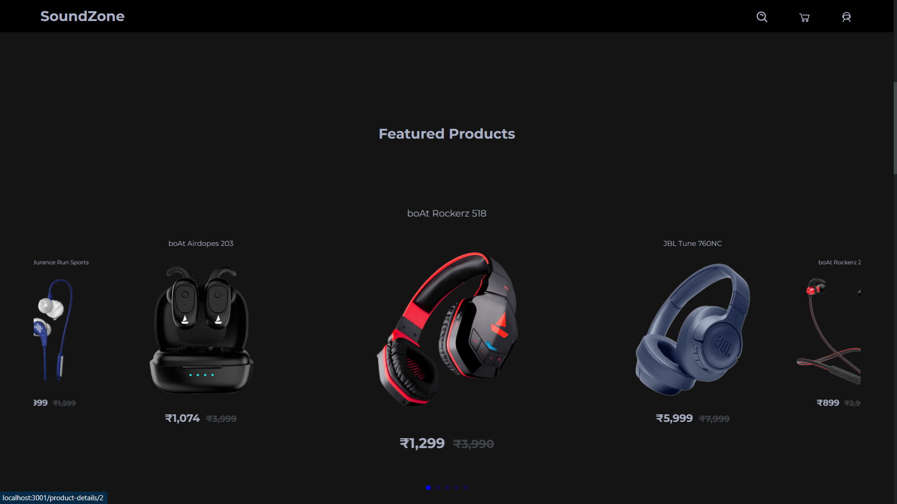
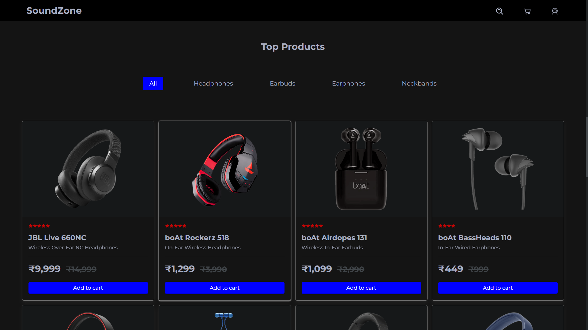
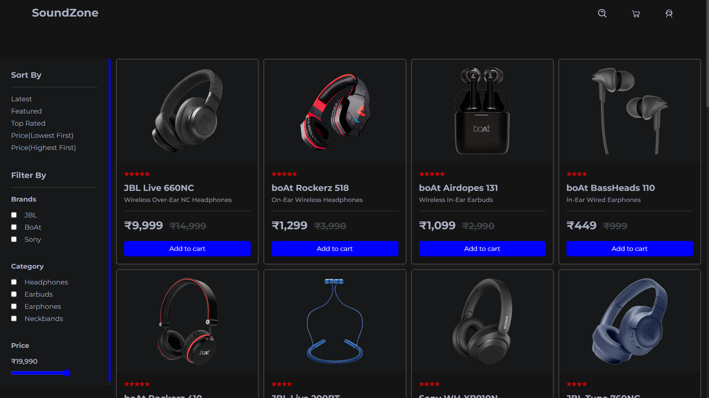
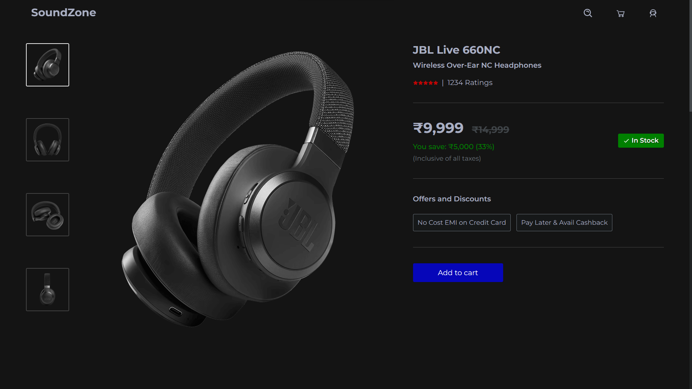
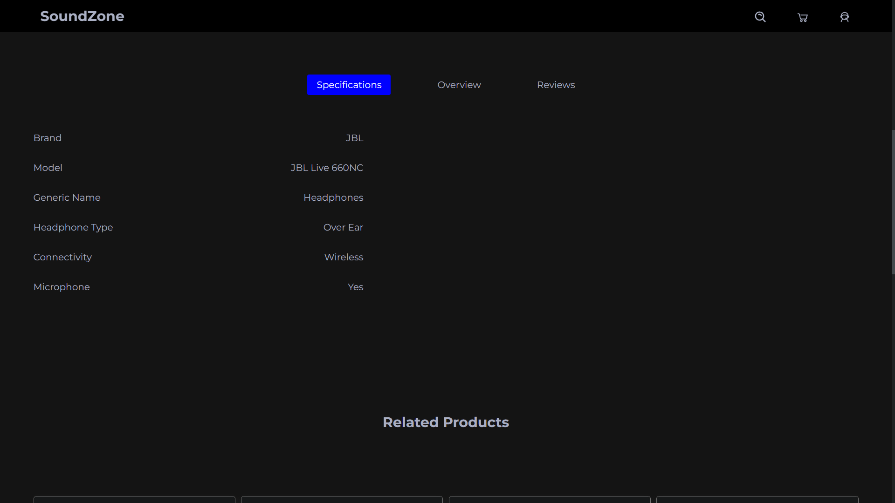
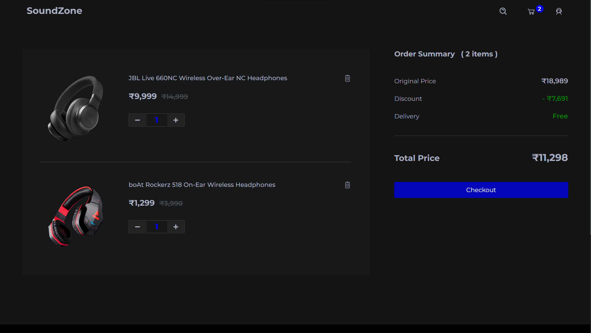
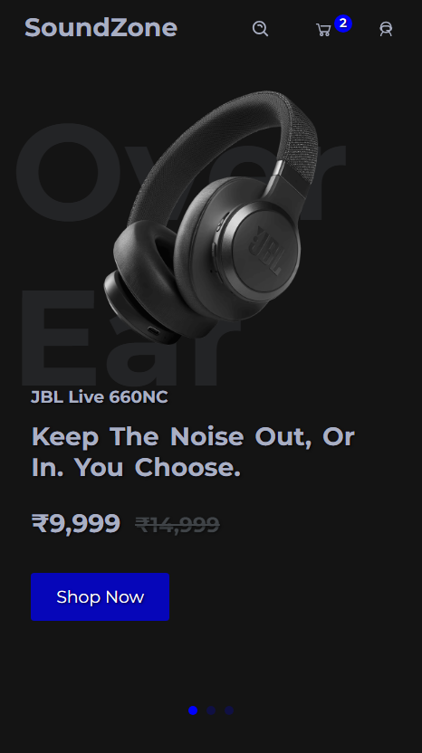

# [SoundZone]

Frontend Audio Store eCommerce Website, built with React JS.

where we can browse through products add them to the cart, search for the products, delete them from cart, sort and filter the products. viww each product's additional product information and spec.

- Live Site URL: [https://soundzone-248e1.web.app/]

## Technologies used

- React
- React Swiper
- React Router
- React context API (for state management)
- javascript
- CSS
- HTML

## Table of contents

- [Overview](#overview)
  - [Screenshot](#screenshot)
  - [Links](#links)
- [Built with](#built-with)

## Overview

This is a frontend ecommerce web application created with React.

The ecommerce website is based on audio products. The products can be viewed in detail, browsed by sorting and filtering based on brand, category, price, toprated, featured. They can be added and removed from cart.

All the above features are managed mainly through React Context Api and React Router.

### Screenshots

#### Desktop images

##### Home page

##### Featured products

##### Top products

##### All Products Sorting and Filtering

##### Products Detail Page

##### Cart Page

#### Mobile responsive

### Links

- Live Site URL: [https://soundzone-248e1.web.app/]

## Built with

- HTML
- CSS
- JavaScript
- React
- React Swiper
- React Router
- React Context API
